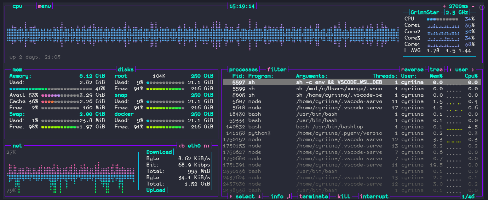

  

## Grimmstar [Bashtop](https://github.com/aristocratos/bashtop) Theme

#### Install
Copy theme file to `$HOME/.config/bashtop/user_themes`, and then select the theme from within Bashtop's Options menu.

> The builtin theme downloader places the default themes in `$HOME/.config/bashtop/themes`.
> User created themes should be placed in `$HOME/.config/bashtop/user_themes` to be safe from overwrites.
